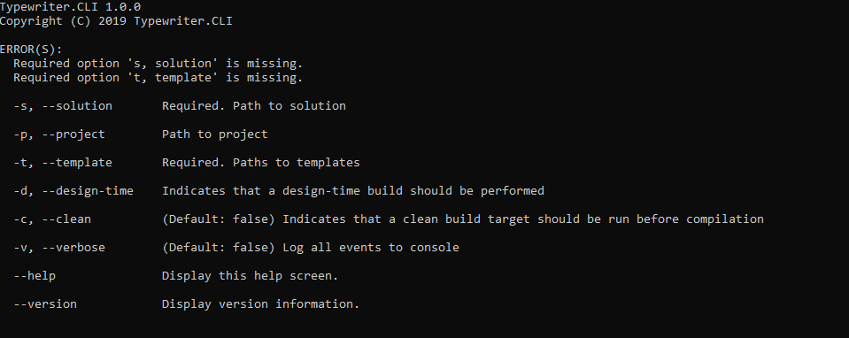

# Typewriter.CLI
Typewriter.CLI is .NET Core port of [Typewriter](http://frhagn.github.io/Typewriter) that generates TypeScript files from c# code files using TypeScript Templates.

## Restrictions
* IncludeCurrentProject is not supported. Please use IncludeProject or Project provided in projectPath parameter will be used
* IncludeReferencedProjects is not supported. Please use IncludeProject or Project provided in projectPath parameter will be used
* IncludeAllProjects is not supported when project parameter is provided
